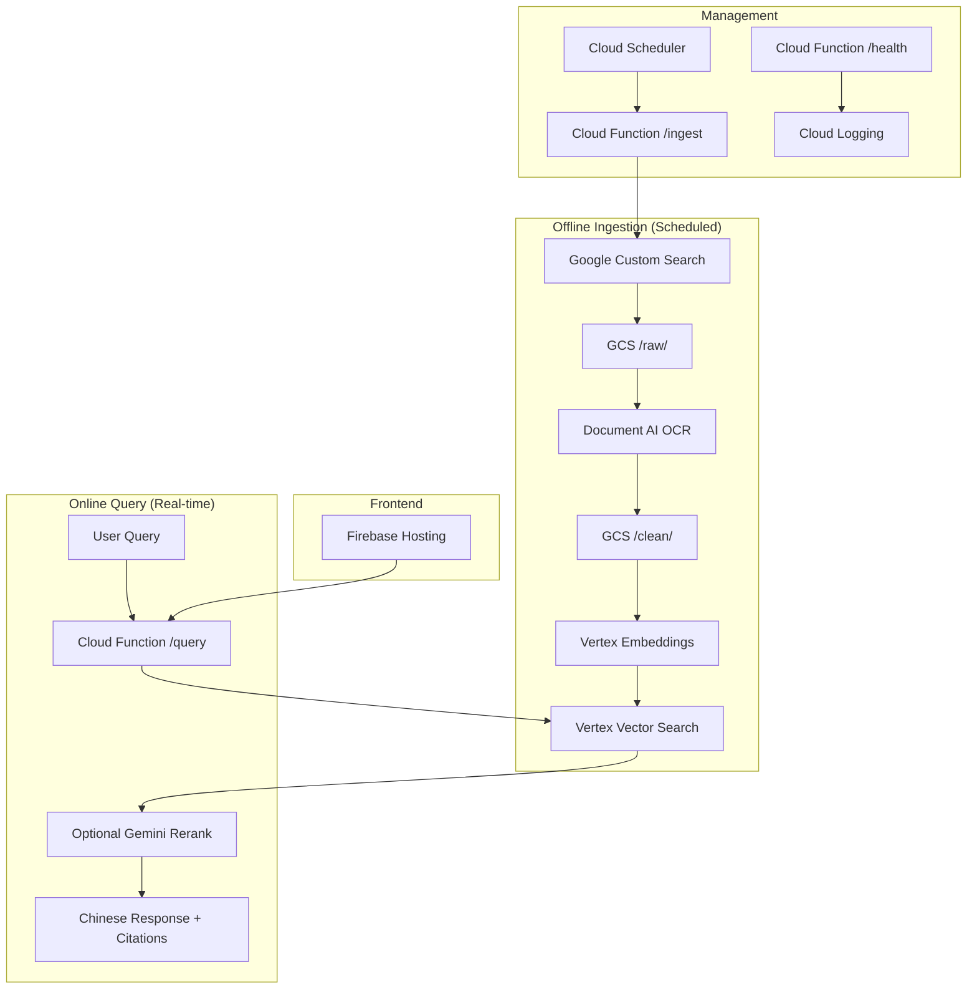

# Design Document

## Overview

The Nemo Compliance MVP is a serverless, Google Cloud-native system that provides verified regulatory information for Chinese energy projects. The architecture follows a two-phase approach: offline ingestion of curated government documents and online deterministic retrieval from a managed vector index. This design eliminates the unreliability of live web searches while ensuring regulation-grade accuracy.

## Architecture

### High-Level Architecture



### Service Architecture

The system uses three main Cloud Functions:

1. **`/ingest`** - Secured ingestion pipeline (triggered by Cloud Scheduler)
2. **`/query`** - Public query endpoint for real-time responses  
3. **`/health`** - Public health check endpoint

## Components and Interfaces

### 1. Ingestion Pipeline (`/ingest`)

**Purpose:** Discover, process, and index regulatory documents offline

**Components:**
- **Document Discovery:** Google Custom Search Engine with allowlisted domains
- **Document Processing:** Document AI for OCR and text extraction
- **Text Sanitization:** Normalize Chinese text, extract metadata
- **Chunking:** 800-token chunks with 100-token overlap
- **Embedding:** Vertex AI `text-embedding-004`
- **Indexing:** Vertex AI Vector Search with metadata filters

**Key Interfaces:**
```python
# /lib/cse.py
def discover_documents(province: str, asset: str, doc_class: str) -> List[str]:
    """Discover new document URLs from allowlisted domains"""

# /lib/docai.py  
def process_document(gcs_uri: str) -> Dict[str, Any]:
    """OCR and extract text/metadata from document"""

# /lib/sanitize.py
def normalize_text(text: str) -> str:
    """Normalize Chinese text and punctuation"""
    
def extract_effective_date(text: str) -> Optional[str]:
    """Extract effective date from document text"""

# /lib/chunker.py
def create_chunks(text: str, chunk_size: int = 800, overlap: int = 100) -> List[Dict]:
    """Create overlapping text chunks with metadata"""

# /lib/vertex_index.py
def upsert_chunks(chunks: List[Dict]) -> None:
    """Upsert chunks to Vertex Vector Search index"""
```

### 2. Query Pipeline (`/query`)

**Purpose:** Process user queries and return verified regulatory information

**Components:**
- **Query Processing:** Normalize and embed user questions
- **Vector Retrieval:** Search indexed documents with metadata filters
- **Optional Reranking:** Gemini 1.5 Pro for relevance scoring (disabled by default)
- **Response Composition:** Extract verbatim quotes with proper citations

**Key Interfaces:**
```python
# /lib/vertex_index.py
def search_documents(
    query_vector: List[float], 
    filters: Dict[str, str], 
    top_k: int = 12
) -> List[Dict]:
    """Search vector index with metadata filters"""

# /lib/composer.py
def compose_response(
    chunks: List[Dict], 
    question: str, 
    lang: str = "zh-CN"
) -> Dict[str, Any]:
    """Compose Chinese response with verbatim quotes and citations"""

def extract_verbatim_quotes(text: str, keywords: List[str]) -> List[str]:
    """Extract verbatim spans matching query keywords"""
```

### 3. Health Monitoring (`/health`)

**Purpose:** Provide system status and operational metrics

**Interface:**
```python
def health_check() -> Dict[str, Any]:
    """Return system health status"""
    return {
        "status": "ok",
        "timestamp": "2025-08-31T12:34:56Z", 
        "commit": "abc123",
        "region": "asia-east2",
        "vertex_index_status": "healthy"
    }
```

## Data Models

### Document Metadata Schema

```json
{
  "title": "广东省光伏并网管理办法",
  "url": "https://gd.gov.cn/...",
  "effective_date": "2024-06-01",
  "province": "gd", 
  "asset": "solar",
  "doc_class": "grid",
  "lang": "zh-CN",
  "text": "...UTF-8 normalized Chinese text...",
  "checksum": "sha256:...",
  "ingested_at": "2025-08-31T12:34:56Z"
}
```

### Vector Index Metadata

Each chunk in Vertex Vector Search includes metadata for filtering:
- `province`: "gd" | "sd" | "nm" 
- `asset`: "solar" | "coal" | "wind"
- `doc_class`: "grid" (MVP scope)
- `effective_date`: "YYYY-MM-DD" or null
- `title`: Document title
- `url`: Source government portal URL
- `checksum`: Document hash for deduplication

### API Request/Response Models

**Query Request:**
```json
{
  "province": "gd",
  "asset": "solar", 
  "doc_class": "grid",
  "question": "并网验收需要哪些资料？",
  "lang": "zh-CN"
}
```

**Query Response:**
```json
{
  "mode": "vertex_rag",
  "elapsed_ms": 890,
  "answer_zh": "并网要点（广东 / 光伏）\n- 相关规定：\n • 光伏项目在广东需提交技术资料与安全评估等。〔《广东省光伏并网管理办法》，生效：2024-06-01〕",
  "citations": [
    {
      "title": "广东省光伏并网管理办法",
      "effective_date": "2024-06-01", 
      "url": "https://gd.gov.cn/..."
    }
  ],
  "trace_id": "gaea-20250831-001"
}
```

## Error Handling

### Ingestion Error Handling

1. **Document Discovery Failures:**
   - Log failed CSE queries with trace_id
   - Continue processing other provinces/assets
   - Retry with exponential backoff (max 3 attempts)

2. **Document Processing Failures:**
   - Store failed documents in separate GCS path for manual review
   - Log OCR failures with document metadata
   - Skip corrupted documents, don't crash pipeline

3. **Indexing Failures:**
   - Retry chunk upserts with exponential backoff
   - Log failed chunks for manual investigation
   - Continue processing remaining chunks

### Query Error Handling

1. **No Results Found:**
   - Return structured refusal message in Chinese
   - Provide actionable tips for query refinement
   - Log query patterns for ingestion gap analysis

2. **Vector Search Failures:**
   - Return 500 error with trace_id
   - Log full error context for debugging
   - Implement circuit breaker for repeated failures

3. **Timeout Handling:**
   - Set 30-second timeout for vector search
   - Return partial results if available
   - Log performance metrics for optimization

### Error Response Format

```json
{
  "error": true,
  "message": "Vector search timeout",
  "trace_id": "gaea-20250831-002", 
  "timestamp": "2025-08-31T12:34:56Z",
  "tips": ["Try a more specific query", "Check system status"]
}
```

## Testing Strategy

### Unit Testing

**Coverage Areas:**
- Text sanitization and normalization functions
- Date extraction regex patterns  
- Chunking logic with overlap calculations
- Citation formatting and quote extraction
- Metadata filter construction

**Test Framework:** pytest with fixtures for sample Chinese documents

### Integration Testing

**Staging Environment:**
- Dedicated Vertex Vector Search index with 20-50 sample documents
- Test document corpus covering all provinces/assets/doc_classes
- Isolated GCS buckets for test data

**Test Scenarios:**
- End-to-end ingestion pipeline with sample documents
- Query pipeline with known good/bad queries
- Error handling with malformed inputs
- Performance testing with concurrent queries

### Golden Set Evaluation

**Metrics:**
- **Precision@5:** ≥90% of top-5 results contain correct citations
- **Coverage:** ≥90% of queries return at least 1 relevant result  
- **Response Time:** p95 < 2.0 seconds with rerank disabled

**Process:**
- Maintain 30-50 golden queries per province/asset combination
- Weekly automated evaluation against staging environment
- Human evaluation for citation accuracy and quote quality

### End-to-End Testing

**Frontend Testing:**
- Cypress tests for province selection, query submission, result rendering
- Mobile responsiveness testing
- Accessibility testing for Chinese text rendering

**API Testing:**
- Load testing with 100 concurrent queries
- Failover testing with Vertex AI service disruptions
- Security testing for injection attacks

## Performance Considerations

### Query Performance

**Target Metrics:**
- p95 response time: <2.0 seconds
- p99 response time: <5.0 seconds  
- Throughput: 100 queries/second

**Optimization Strategies:**
- Vertex Vector Search with optimized index configuration
- Reranking disabled by default (toggle via environment variable)
- Efficient metadata filtering to reduce search space
- Response caching for common queries (future enhancement)

### Ingestion Performance

**Batch Processing:**
- Process documents in parallel with Cloud Functions concurrency
- Batch embedding requests to Vertex AI (up to 100 per request)
- Rate limiting to avoid quota exhaustion

**Storage Optimization:**
- Compress raw documents in GCS with gzip
- Deduplicate documents by checksum before processing
- Incremental ingestion based on document modification dates

### Scalability Design

**Horizontal Scaling:**
- Cloud Functions automatically scale based on request volume
- Vertex Vector Search handles concurrent queries natively
- GCS provides unlimited storage capacity

**Resource Management:**
- Monitor Vertex AI quotas and request increases proactively
- Implement exponential backoff for rate-limited services
- Use Cloud Monitoring for resource utilization tracking

## Security and Compliance

### Data Security

**Document Handling:**
- All documents sourced from verified government portals only
- No PII or sensitive information in document corpus
- Secure transmission via HTTPS for all API calls

**Access Control:**
- `/ingest` endpoint secured with shared token authentication
- `/query` and `/health` endpoints publicly accessible
- Service account permissions follow principle of least privilege

### API Security

**Input Validation:**
- Sanitize all user inputs to prevent injection attacks
- Validate province/asset/doc_class against allowed values
- Rate limiting on query endpoint to prevent abuse

**Secret Management:**
- All API keys stored in Google Secret Manager
- No secrets in code or environment variables
- Automatic secret rotation capability

### Compliance Considerations

**Data Residency:**
- All data processing within specified Google Cloud region
- No cross-border data transfer for Chinese regulatory documents
- Audit logging for all document access and modifications

**Regulatory Compliance:**
- Source attribution for all regulatory citations
- Effective date tracking for regulatory changes
- Immutable audit trail for document ingestion and updates